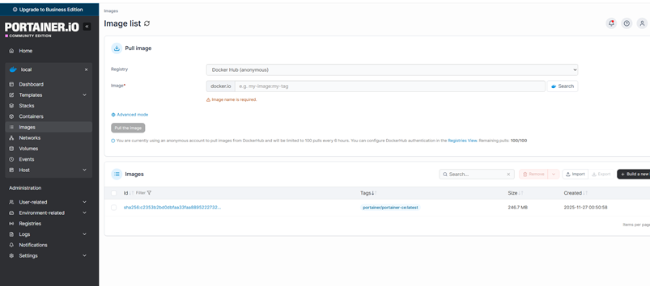

# Install Portainer to manage containers from a graphical interface

Portainer allows you to create, start, stop, configure and monitor Docker containers directly through a web dashboard. Rather than typing commands in the shell, we can interact with our containers through a user-friendly graphical interface.

**1)To start, I created the volume**

```bash
sudo docker volume create portainer_data
```

**2)I started Portainer**

```bash
sudo docker run -d \
  -p 8000:8000 \
  -p 9443:9443 \
  --name portainer \
  --restart=always \
  -v /var/run/docker.sock:/var/run/docker.sock \
  -v portainer_data:/data \
  portainer/portainer-ce:latest
```
- sudo docker run -d: Starts Portainer in detached mode. This means the terminal won't remain blocked and you can continue working while the container is running.
- -p 8000:8000 -p 9443:9443: Maps ports 8000 (HTTP) and 9443 (HTTPS) for access to the Portainer web service.
- --name portainer: Names the container as "portainer".
- --restart=always: Automatically restarts Portainer if the container stops or if the system is rebooted.
- -v /var/run/docker.sock:/var/run/docker.sock: Allows Portainer to communicate with Docker on the host for container management.
- -v portainer_data:/data: Saves Portainer configuration data in a persistent volume.
- portainer/portainer-ce:latest: Uses the latest version of Portainer Community Edition.

3)**I opened Portainer from a web browser in HTTPS version**

```bash
https://IP-DELLA-VM:9443      # HTTPS on port 9443, otherwise 8000 with http
```



Portainer is ready to use, so we proceed to the next step, step 4, where I will install the Wireguard container for VPN and Adguard as a tracking and advertising filter.
