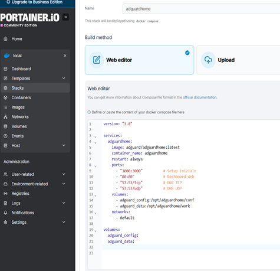
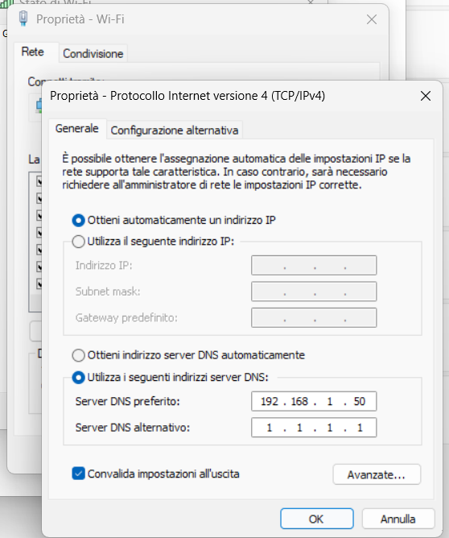
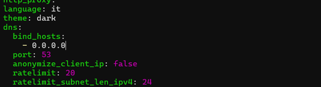

# ADGUARD configuration with Portainer

When you create a container in Advanced container settings → Restart policy, the options are:

* No - The container never restarts automatically.
* Always - The container always restarts if it stops, including when the server reboots.
* Unless-stopped - Always restarts, except if you stop it manually.
* On-failure - Only restarts if the container terminates with an error. You can also set a maximum number of attempts.

For both Wireguard and ADguard, it is recommended to choose **unless-stopped or always**.

Problem: It was impossible for me to deploy a container on port 53 because it is already occupied on the Ubuntu Server machine.


```bash
sudo netstat -tulnp | grep :53
```

**systemd-resolved** is occupying port 53 on the local interfaces. It is a DNS (Domain Name System) resolution management service present in modern Linux distributions.

**Solution:**

**Disable systemd-resolved**
```bash
sudo systemctl stop systemd-resolved
sudo systemctl disable systemd-resolved
```

**Fix /etc/resolv.conf**
Systemd-resolved uses a symbolic link for resolv.conf, so we need to remove it and create a new file:

```bash
sudo rm /etc/resolv.conf
sudo bash -c "echo 'nameserver 1.1.1.1' > /etc/resolv.conf"
sudo systemctl restart docker     #Restart Docker (optional but recommended)
```

## ADGUARD

1)**I created volumes for Adguard from the left menu in Portainer**

adguard_config <br>
adguard_data

2)**From Portainer --> stack --> new stack --> paste the desired docker compose**
```bash
version: "3"
services:
  adguardhome:
    image: adguard/adguardhome:latest
    container_name: adguardhome
    restart: unless-stopped
    ports:
      - "53:53/tcp"
      - "53:53/udp"
      - "8092:80/tcp"
      - "3000:3000/tcp"
      - "4464:443/tcp"
      - "4464:443/udp"
      - "853:853/tcp"
      - "853:853/udp"
    volumes:    #Container data mounted on these volumes will be persistent, even if the container is deleted.
      - adguard_work:/opt/adguardhome/work  
      - adguard_conf:/opt/adguardhome/conf

volumes:    #Docker automatically creates internally managed volumes
  adguard_work:
  adguard_conf:

```



### ADguard Home configuration

http://IPSERVER:3000       


1. Follow the guided procedure:
2. Leave directories as they are (they are the two volumes)
3. Leave ports 80 / 443
4. Create login

Then it will be possible to log in normally at:
http://IPSERVER:80
Enable HTTPS (directly from AdGuard later) from settings → Encryption

**If you have a domain:**
1. choose Let's Encrypt
2. enter domain
3. enter email

**If you do NOT have a domain:**
choose Self-signed certificate

**the container will use the port:**
https://IPSERVER:8443

### From windows e mobile devices I set the Adguard container as the preferred DNS server


**wind+R → ncpa.cpl → properties → ipv4 → set manual DNS**

**To make ADguard work also with mobile devices connected via VPN, you need to modify the AdGuardHome.yaml file by setting bind_host: 0.0.0.0**
```bash
find / -name AdGuardHome.yaml    #per trovare file
```


```bash
docker restart adguardhome
```

To make Adguard work as a DNS server, it may be necessary to connect to your home router and disable the setting that forces your internet provider's DNS server on all connected devices, thus making it possible to use ADguard.

After doing this, check on sites like DNSleak.com whether your ISP's DNS is present or the various Cloudflare DNS servers from Adguard.

