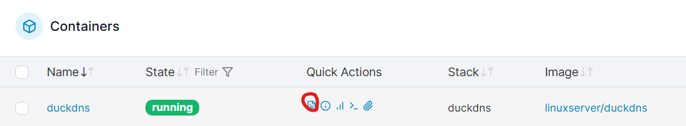

# WIREGUARD stack configuration

1) Create volume wireguard_config.

2) Create a new stack called wireguard and paste this YAML file.

```bash
version: "3.8"
services:
  wireguard:
    image: linuxserver/wireguard:latest
    container_name: wireguard
    cap_add:
      - NET_ADMIN
      - SYS_MODULE
    network_mode: host        # network type is host
    environment:
      - PUID=1000
      - PGID=1000
      - TZ=Europe/Rome
      - SERVERURL= auto or set public IP    # set public IP!
      - SERVERPORT=******    ## set any port you like, e.g.: 51076
      - PEERS=2           
      - PEERDNS=*******       #my private ubuntu server IP
      - INTERNAL_SUBNET=       #private network different from the LAN private network, e.g.: 10.10.10.0
      - LOG_CONFS=true         #LOG_CONFS=true will make QR codes appear in the logs.

    volumes:
      - wireguard_config:/config    #contains the peers’ private keys
      -/lib/modules:/lib/modules
    restart: unless-stopped

    ports:
      - 50000:50000/udp        #the port I chose
    sysctls:
      - net.ipv4.conf.all.src_valid_mark=1
    restart: unless-stopped

volumes:
  wireguard_config:
    external: true

```

To finish, scan the QR code with the Wireguard app on the mobile device and check that the data is correct (IP and ports).

On the router you must configure port forwarding for the chosen port, on your home router!

## DDNS in case of dynamic IP

Since my ISP assigns me a different IP each time the home “router” is restarted, I created a DDNS domain with a free plan and replaced the endpoint with that domain so that if the IP changes, I do not have to manually modify the endpoint IP on my mobile device.

In addition, to have more flexibility and unlimited subdomains, I created a free DuckDNS domain. DuckDNS provides a domain name such as enrisox.duckdns.org and allows you to add multiple subdomains without limits. The Raspberry automatically updates the public IP associated with this domain via a DuckDNS container or a cron script, so that all services hosted on the device remain always reachable even if the IP changes.

This approach makes it possible to centralize the management of subdomains for the various services, such as web apps or internal servers, and simplifies the configuration of a reverse proxy like Nginx Proxy Manager, which will route each subdomain to the correct container while maintaining security and HTTPS support via Let’s Encrypt certificates.

```bash
version: "3.9"

services:
  duckdns:
    image: linuxserver/duckdns
    container_name: duckdns
    environment:
      - PUID=1000              # you can find it with the command id <your user>
      - PGID=1000              # you can find it with the command id <your user>
      - TZ=Europe/Rome
      - SUBDOMAINS=DOMINIOSCELTO    # your main domain
      - TOKEN=IL_TUO_TOKEN_DUCKDNS          #you can find it on duckdns.org in the profile section
    restart: unless-stopped
```
By clicking on the duckdns container logs you should see this message:


Detecting IPv4 via DuckDNS
DuckDNS request at Sun Dec  7 20:28:50 CET 2025 successful. IP(s) unchanged.
